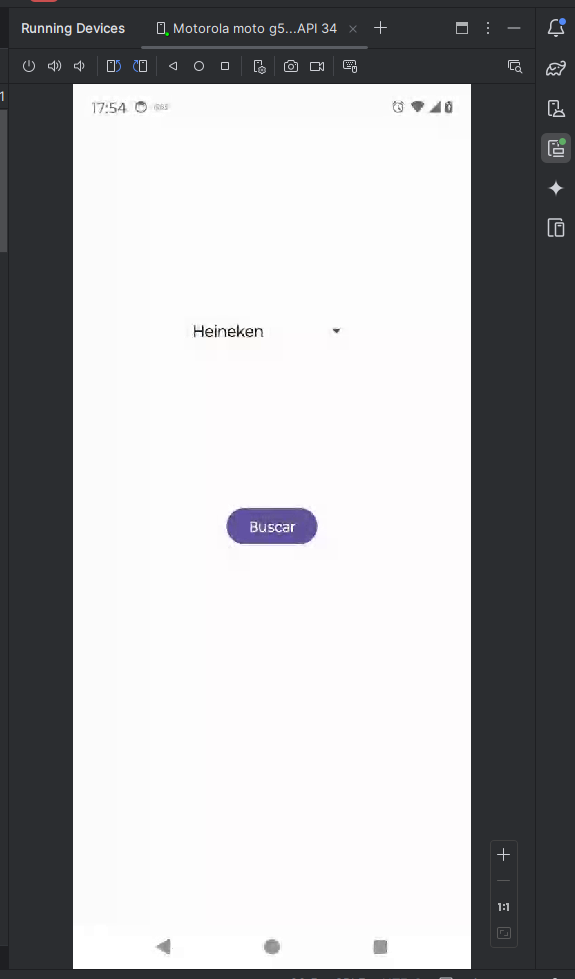
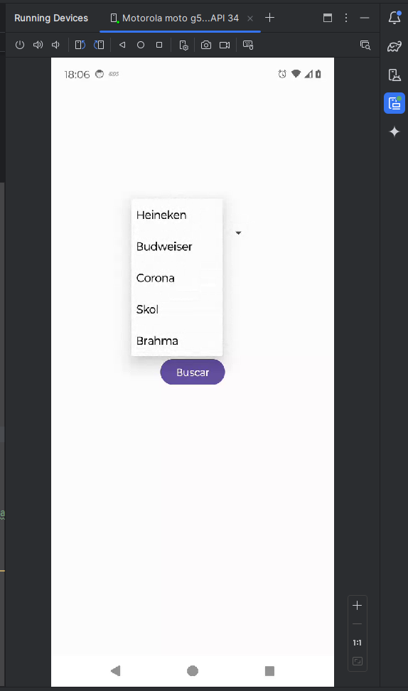
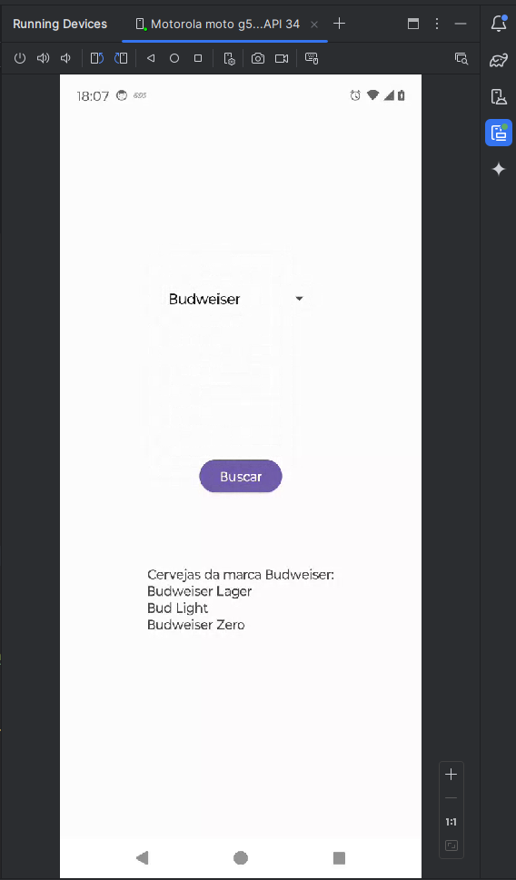

# ExpertCerveja -- Consultor de Cerveja

### Funcionalidades

>Construir um aplicação que terá três componentes:
>- Lista de opções de tipos de cerveja
>- Um botão que ao ser clicado busca as marcas do tipo de cerveja selecionada
>- Um campo de texto que mostra as marcas de cerveja do tipo selecionado

## Pedaços importates de Codigos:

```kotlin
// Faz uma mapeamento das marcas e seus tipos de cervejas.
    private val beerBrands = mapOf(
        "Heineken" to listOf("Heineken Original", "Heineken Light", "Heineken 0.0"),
        "Budweiser" to listOf("Budweiser Lager", "Bud Light", "Budweiser Zero"),
        "Corona" to listOf("Corona Extra", "Corona Light", "Corona Premier"),
        "Skol" to listOf("Skol Pilsen", "Skol Hops", "Skol Beats"),
        "Brahma" to listOf("Brahma Pilsen", "Brahma Duplo Malte", "Brahma Extra")
    )
```

```kotlin
// Lista de marcas de cervejas
        val beerList = listOf("Heineken", "Budweiser", "Corona", "Skol", "Brahma")

// Spinner
        val adapter = ArrayAdapter(this, android.R.layout.simple_spinner_item, beerList)
        adapter.setDropDownViewResource(android.R.layout.simple_spinner_dropdown_item)
        spinner.adapter = adapter
```

```kotlin
// Implementação do Botão "Buscar"
        button.setOnClickListener {
            val selectedBrand = spinner.selectedItem.toString()
            val beers = beerBrands[selectedBrand]?.joinToString("\n") ?: "Nenhuma cerveja encontrada"
            textView.text = "Cervejas da marca $selectedBrand:\n$beers"
        }
```

## Prints app funcionado:

<div>



</div>

