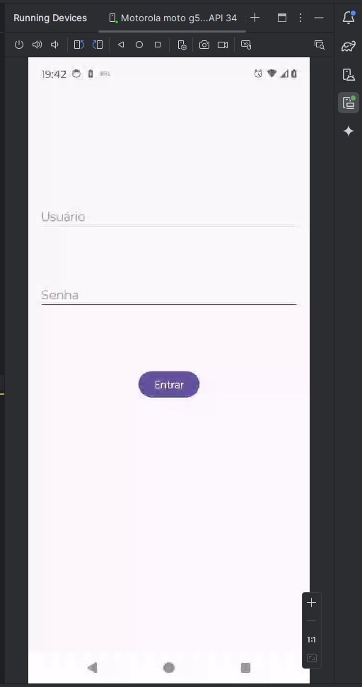
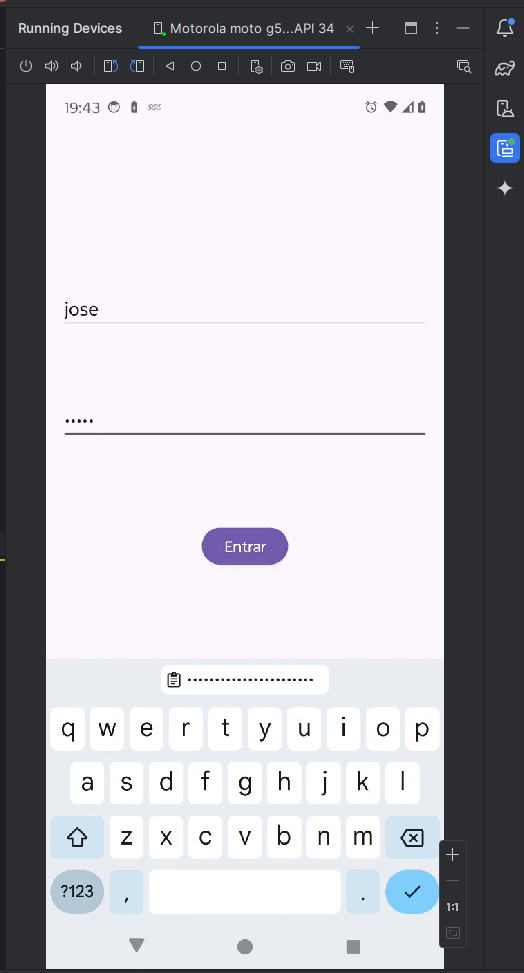
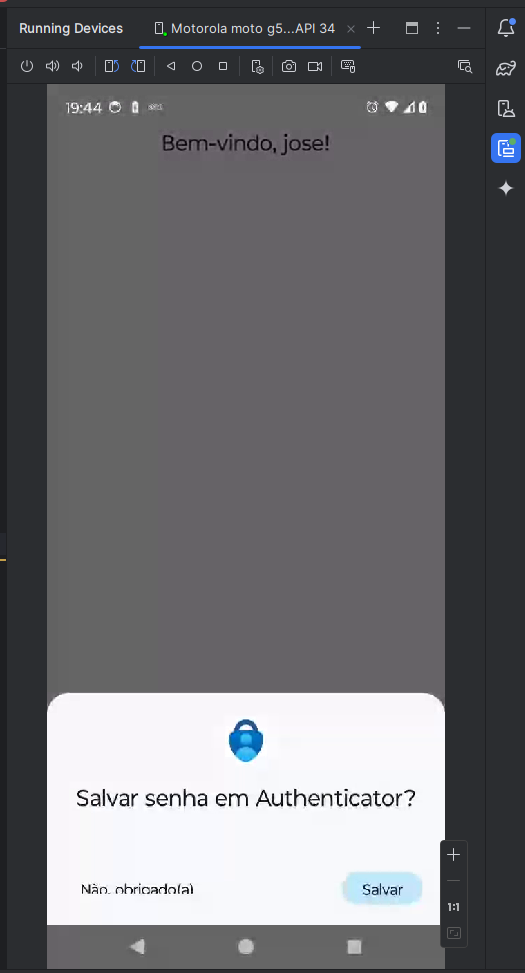

# Login Simples -- Login

### Funcionalidades

> Uma atividade se comporta como uma tela de login (usuário e senha)
>- Deve-se verificar os dados
>- Se correto: enviar para a segunda atividade
>- Caso contrário: informar ao usuário, limpar os campos e permitir entrar novamente

> A segunda atividade recebe e mostra uma frase de boa vinda junto com o nome do
usuário passado como parâmetro

## Pedaços importantes de Códigos:

```kotlin
// Login e senha
        val correctUsername = "jose"
        val correctPassword = "admin"
```

```kotlin
            if (enteredUsername == correctUsername && enteredPassword == correctPassword) {
                // Bundle para passar dados
                val bundle = Bundle().apply {
                    putString("USERNAME", enteredUsername)
                }

                val intent = Intent(this, WelcomeActivity::class.java).apply {
                    putExtras(bundle)
                }
                startActivity(intent)
                finish()
            } else {
                errorMessage.visibility = TextView.VISIBLE
                usernameEditText.text.clear()
                passwordEditText.text.clear()
            }
```

```kotlin
// Receber o nome do usuário passado pela LoginActivity
        val username = intent.getStringExtra("USERNAME")

        welcomeMessage.text = "Bem-vindo, $username!"
```

## Prints app funcionado:

<div>



</div>

