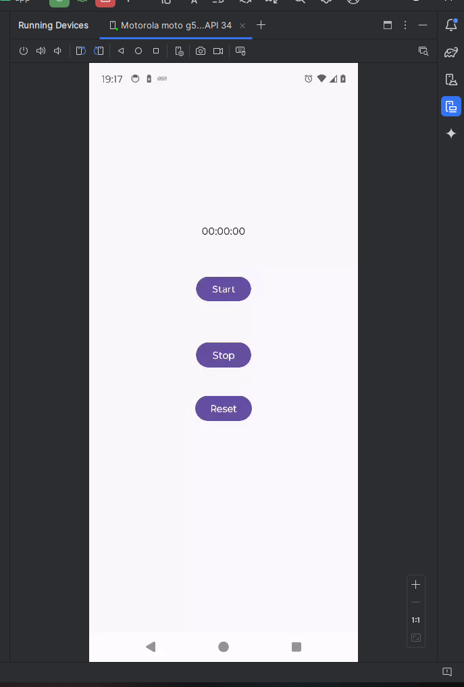
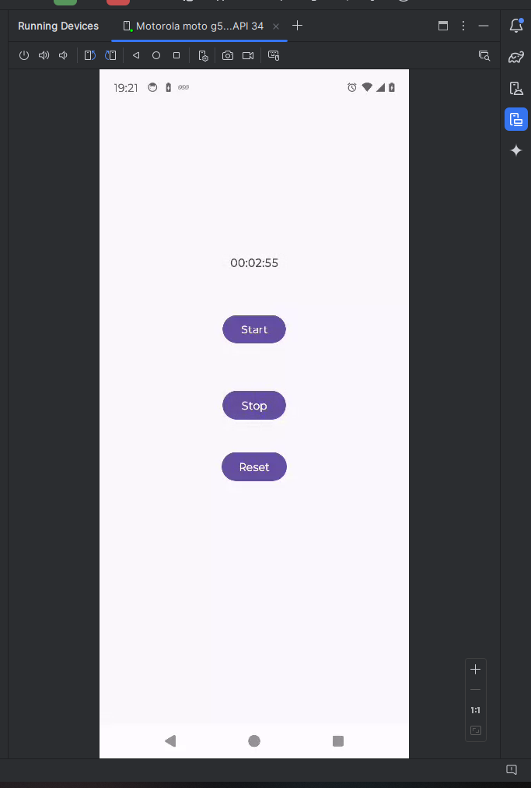

# Cronometro versão 1

### Funcionalidades

>Construir um aplicação que terá três componentes:
>- Um cronômetro e temporizador (contagem regressiva)
>- Opção de iniciar, pausar e zerar: criar três botões
>- Funcionalidade não disponível: avisar ao usuário

## Pedaços importantes de Códigos:

```kotlin
// Iniciar o cronômetro
    fun onClickStart(view: View) {
        running = true
    }

// Parar o cronômetro
    fun onClickStop(view: View) {
        running = false
    }

// Resetar o cronômetro
    fun onClickReset(view: View) {
        running = false
        seconds = 0
    }
```

```kotlin
    // Executa o cronômetro e atualiza o TextView a cada segundo
    private fun runTimer() {
        handler.post(object : Runnable {
            override fun run() {
                val hours = seconds / 3600
                val minutes = (seconds % 3600) / 60
                val secs = seconds % 60

                val time = String.format("%02d:%02d:%02d", hours, minutes, secs)
                timeView.text = time

                if (running) {
                    seconds++
                }
                handler.postDelayed(this, 1000)
            }
        })
    }
```

## Prints app funcionado:

<div>



</div>

